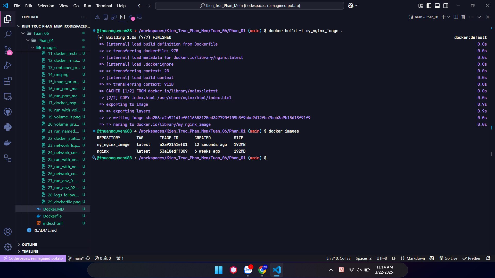

# Docker - Các Lệnh Cơ Bản 🐳

## 1. Kiểm tra phiên bản Docker ℹ️

Kiểm tra phiên bản hiện tại của Docker đã cài đặt.

```bash
docker --version
```


_Hình ảnh hiển thị kết quả lệnh docker --version, cho thấy phiên bản Docker đang được cài đặt trên hệ thống._

## 2. Kiểm tra cài đặt Docker ✅

Chạy thử container "hello-world" để xác nhận Docker hoạt động.

```bash
docker run hello-world
```


_Hình ảnh hiển thị kết quả chạy container hello-world, xác nhận Docker đã được cài đặt và hoạt động bình thường._

## 3. Tải xuống images 📥

Tải image Nginx từ Docker Hub.

```bash
docker pull nginx
```


_Hình ảnh hiển thị quá trình tải image nginx từ Docker Hub về máy local, hiển thị các layer được tải xuống._

## 4. Liệt kê images 🖼️

Xem danh sách các image có trên máy.

```bash
docker images
```


_Hình ảnh hiển thị kết quả lệnh docker images, liệt kê các image đã tải về máy bao gồm tên, tag, ID, kích thước và thời gian tạo._

## 5. Chạy container ▶️

Chạy container Nginx ở chế độ nền (detached).

```bash
docker run -d nginx
```


_Hình ảnh hiển thị kết quả lệnh khởi chạy container nginx ở chế độ nền, trả về ID của container vừa được tạo._

## 6. Liệt kê containers đang chạy 🚀

Hiển thị các container đang hoạt động.

```bash
docker ps
```


_Hình ảnh hiển thị danh sách các container đang chạy, bao gồm thông tin về ID, image, lệnh thực thi, thời gian tạo và trạng thái._

## 7. Liệt kê tất cả containers 📋

Xem tất cả container (bao gồm đã dừng).

```bash
docker ps -a
```


_Hình ảnh hiển thị tất cả container (cả đang chạy và đã dừng), cung cấp cái nhìn tổng quan về mọi container trên hệ thống._

## 8. Xem logs của container 📜

Kiểm tra nhật ký hoạt động của container.

```bash
docker logs <container_id>
```


_Hình ảnh hiển thị logs của container được chỉ định, cho phép xem các thông báo và hoạt động được ghi lại trong container._

## 9. Truy cập terminal container 🖥️

Mở shell để tương tác với container.

```bash
docker exec -it <container_id> /bin/sh
```


_Hình ảnh hiển thị việc truy cập vào terminal của container đang chạy, cho phép thực hiện các lệnh trực tiếp trong môi trường container._

## 10. Dừng container ⏹️

Tạm dừng hoạt động của container.

```bash
docker stop <container_id>
```


_Hình ảnh hiển thị kết quả của lệnh dừng container, trả về ID của container vừa được dừng lại._

## 11. Khởi động lại container 🔄

Khởi động lại container đang dừng.

```bash
docker restart <container_id>
```


_Hình ảnh hiển thị quá trình khởi động lại container đã dừng, trả về ID của container được restart._

## 12. Xóa container 🗑️

Xóa một container đã dừng.

```bash
docker rm <container_id>
```


_Hình ảnh hiển thị kết quả xóa container đã chỉ định, trả về ID của container vừa bị xóa khỏi hệ thống._

## 13. Xóa tất cả containers đã dừng 🧹

Dọn dẹp các container không còn sử dụng.

```bash
docker container prune
```


_Hình ảnh hiển thị quá trình xóa tất cả container đã dừng, giải phóng tài nguyên và không gian lưu trữ trên hệ thống._

## 14. Xóa images ❌

Xóa một image cụ thể theo ID.

```bash
docker rmi <image_id>
```


_Hình ảnh hiển thị quá trình xóa image, bao gồm việc xóa các layer liên quan đến image đó._

## 15. Xóa tất cả images không sử dụng 🧼

Dọn sạch các image không còn cần thiết.

```bash
docker image prune -a
```


_Hình ảnh hiển thị quá trình dọn dẹp tất cả image không được sử dụng, giải phóng không gian đĩa và làm sạch hệ thống._

## Quản lý Containers 🛠️

## 16. Chạy container với port mapping 🌐

Ánh xạ cổng 8080 của máy chủ tới cổng 80 của container.

```bash
docker run -d -p 8080:80 nginx
```


_Hình ảnh hiển thị lệnh chạy container Nginx với cổng 8080 của máy host được ánh xạ tới cổng 80 của container._


_Hình ảnh hiển thị trang web Nginx mặc định được truy cập qua cổng đã ánh xạ (8080) trên trình duyệt._

## 17. Xem thông tin chi tiết container 🔍

Hiển thị chi tiết cấu hình của container.

```bash
docker inspect <container_id>
```


_Hình ảnh hiển thị thông tin chi tiết về container bao gồm cấu hình mạng, biến môi trường, mount points và nhiều thông số kỹ thuật khác._

## 18. Tạo và dùng volume 💾

Gắn volume "mydata" vào thư mục /data trong container.

```bash
docker run -d -v mydata:/data nginx
```


_Hình ảnh hiển thị lệnh tạo container với volume được gắn kết, cung cấp khả năng lưu trữ dữ liệu bền vững bên ngoài vòng đời của container._

## 19. Liệt kê volumes 📂

Xem danh sách các volume hiện có.

```bash
docker volume ls
```


_Hình ảnh hiển thị danh sách tất cả các volume Docker đã được tạo trên hệ thống, bao gồm volume "mydata" vừa được tạo._

## 20. Xóa volumes không sử dụng 🗑️

Dọn dẹp các volume không còn liên kết.

```bash
docker volume prune
```


_Hình ảnh hiển thị quá trình xóa các volume không còn được container nào sử dụng, giải phóng không gian lưu trữ._

## 21. Chạy container với tên tùy chỉnh 🏷️

Đặt tên "my_nginx" cho container.

```bash
docker run -d --name my_nginx nginx
```


_Hình ảnh hiển thị lệnh tạo container với tên tùy chỉnh "my_nginx" thay vì sử dụng tên ngẫu nhiên do Docker tạo ra._

## 22. Xem tài nguyên sử dụng 📈

Theo dõi CPU, RAM của các container đang chạy.

```bash
docker stats
```


_Hình ảnh hiển thị thông tin theo thời gian thực về mức sử dụng tài nguyên của các container đang chạy, bao gồm CPU, bộ nhớ, mạng và I/O._

## 23. Liệt kê networks 🌐

Hiển thị danh sách các network hiện có.

```bash
docker network ls
```


_Hình ảnh hiển thị danh sách các network Docker có sẵn, bao gồm bridge (mặc định), host và none, cùng với các network do người dùng tạo._

## 24. Tạo network mới 🆕

Tạo một network tùy chỉnh tên "my_network".

```bash
docker network create my_network
```


_Hình ảnh hiển thị kết quả của lệnh tạo mạng mới có tên "my_network", trả về ID của network vừa được tạo._

## 25. Chạy container với network cụ thể 🔗

Chạy container trong network "my_network".

```bash
docker run -d --network my_network --name my_container nginx
```


_Hình ảnh hiển thị lệnh khởi tạo container kết nối với mạng "my_network" đã được tạo trước đó._


_Hình ảnh hiển thị thông tin chi tiết về mạng "my_network", bao gồm danh sách các container được kết nối vào mạng này._

## 26. Kết nối container với network 🔌

Kết nối container "my_nginx" vào network.

```bash
docker network connect my_network my_nginx
```


_Hình ảnh hiển thị việc kết nối container có sẵn "my_nginx" vào mạng "my_network", cho phép container giao tiếp với các container khác trong cùng mạng._

## 27. Chạy container với biến môi trường 🌍

Thiết lập biến môi trường MY_ENV trong container.

```bash
docker run -d -e MY_ENV=hello_world nginx
```


_Hình ảnh hiển thị lệnh tạo container với biến môi trường MY_ENV được thiết lập giá trị "hello_world"._


_Hình ảnh hiển thị kết quả kiểm tra (inspect) container, trong đó có phần hiển thị các biến môi trường đã được cấu hình._

## 28. Theo dõi logs liên tục 👀

Xem logs của container "my_nginx" theo thời gian thực.

```bash
docker logs -f my_nginx
```


_Hình ảnh hiển thị logs của container "my_nginx" đang được theo dõi theo thời gian thực với tùy chọn -f (follow)._

## Tạo Docker Image với Dockerfile 🛠️

## 29. Tạo file Dockerfile 📝

Tạo image từ Nginx và thêm file index.html.

```dockerfile
FROM nginx
COPY index.html /usr/share/nginx/html/index.html
```


_Hình ảnh hiển thị nội dung của Dockerfile đơn giản, lấy image nginx làm base và sao chép file index.html vào thư mục web root._

## 30. Build image từ Dockerfile 🏗️

Xây dựng image với tên "my_nginx_image".

```bash
docker build -t my_nginx_image .
```


_Hình ảnh hiển thị quá trình build image từ Dockerfile, bao gồm từng bước (step) thực thi và kết quả cuối cùng._

## 31. Chạy container từ image đã tạo ▶️

Chạy container từ image tùy chỉnh với port mapping.

```bash
docker run -d -p 8080:80 my_nginx_image
```


_Hình ảnh hiển thị lệnh chạy container từ image tùy chỉnh "my_nginx_image" với port 8080 của host được ánh xạ tới port 80 của container._


_Hình ảnh hiển thị trang web tùy chỉnh được phục vụ bởi container Nginx, xác nhận rằng file index.html đã được sao chép thành công vào image._

---
