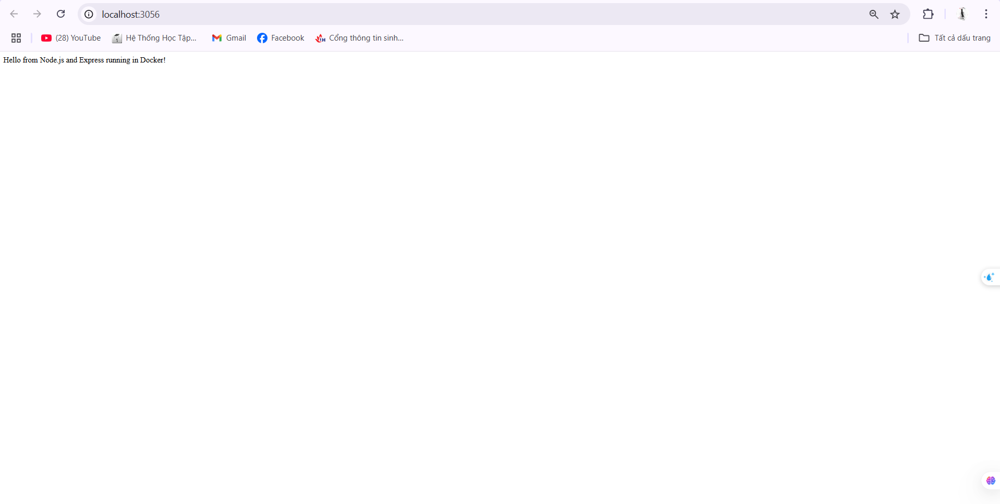
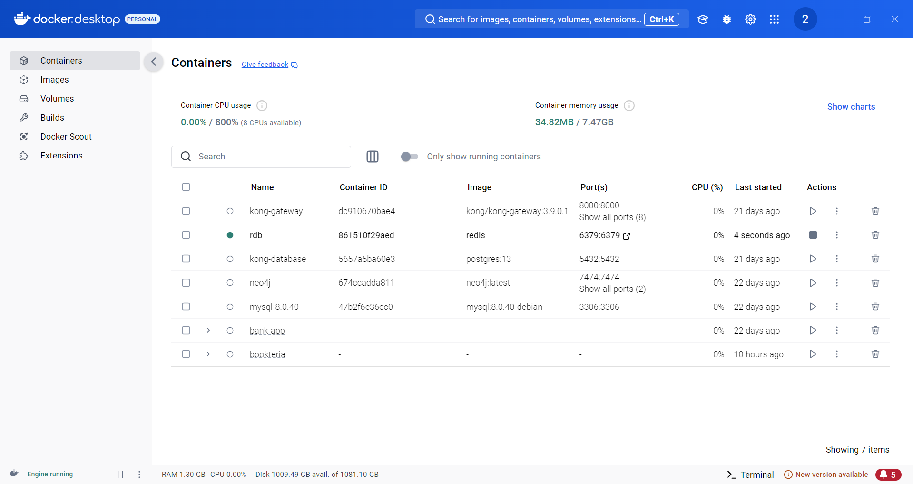

# Docker Compose Guide

## 1. Docker Compose Commands

Common Docker Compose commands for managing containerized applications:

| Lệnh                                           | Mô tả                                                                               |
| ---------------------------------------------- | ----------------------------------------------------------------------------------- |
| `docker compose version`                       | Hiển thị phiên bản của Docker Compose đang được cài đặt                             |
| `docker compose up`                            | Tạo và khởi động tất cả các container được định nghĩa trong file docker-compose.yml |
| `docker compose up -d`                         | Tạo và khởi động các container ở chế độ detached (chạy ngầm trong nền)              |
| `docker compose ps`                            | Liệt kê tất cả các container đang chạy của dự án                                    |
| `docker compose down`                          | Dừng và xóa tất cả các container, networks được tạo bởi lệnh `up`                   |
| `docker compose restart`                       | Khởi động lại tất cả các container đang chạy                                        |
| `docker compose logs -f`                       | Hiển thị logs của tất cả các container và theo dõi liên tục (follow mode)           |
| `docker compose build`                         | Xây dựng hoặc tái xây dựng các image được sử dụng trong compose file                |
| `docker compose exec <service_name> <command>` | Chạy một lệnh trong container đang chạy                                             |
| `docker compose down -v`                       | Dừng và xóa tất cả container, networks và cả volumes                                |
| `docker compose run <service_name> <command>`  | Chạy một lệnh trên container mới của service được chỉ định                          |
| `docker compose stop <service_name>`           | Dừng các container của service được chỉ định mà không xóa chúng                     |
| `docker compose rm <service_name>`             | Xóa các container đã dừng của service được chỉ định                                 |
| `docker compose config`                        | Kiểm tra và hiển thị cấu hình compose file sau khi xử lý biến môi trường, etc.      |
| `docker compose up -d --build`                 | Khởi động các container ở chế độ detached sau khi build lại các image               |

### Docker Compose Command Examples

#### Docker Compose Version


#### Docker Compose Up


#### Docker Compose Up -d (Detached Mode)


#### Docker Compose PS


#### Docker Compose Down


#### Docker Compose Restart


#### Docker Compose Logs -f


#### Docker Compose Build


#### Docker Compose Exec


#### Docker Compose Stop


#### Docker Compose Config


## 2. Docker Compose Examples

### Example 1: Simple Nginx Container

```yaml
name: nginx-simple

services:
  nginx:
    image: nginx:latest
    container_name: nginx_simple
    ports:
      - "8080:80"
```


### Example 2: MySQL Container

```yaml
version: "3.8"

services:
  mysql:
    image: mysql:8.0
    container_name: mysql_container
    environment:
      MYSQL_USER: user
      MYSQL_PASSWORD: password
      MYSQL_DATABASE: mydb
      MYSQL_ROOT_PASSWORD: rootpassword
    ports:
      - "3306:3306"
    volumes:
      - mysql_data:/var/lib/mysql

volumes:
  mysql_data:
```


### Example 3: MySQL with PHPMyAdmin

```yaml
version: "3.8"

services:
  mysql:
    image: mysql:8.0
    container_name: mysql_container
    environment:
      MYSQL_USER: user
      MYSQL_PASSWORD: password
      MYSQL_DATABASE: mydb
      MYSQL_ROOT_PASSWORD: rootpassword
    ports:
      - "3306:3306"
    volumes:
      - mysql_data:/var/lib/mysql

  phpmyadmin:
    image: phpmyadmin/phpmyadmin
    container_name: phpmyadmin_container
    environment:
      PMA_HOST: mysql
      PMA_PORT: 3306
      MYSQL_ROOT_PASSWORD: rootpassword
    ports:
      - "8081:80"
    depends_on:
      - mysql

volumes:
  mysql_data:
```


### Example 4: Node.js Application

```yaml
version: "3.8"

services:
  nodejs:
    image: node:18
    container_name: nodejs_app
    working_dir: /app
    volumes:
      - ./app:/app
    ports:
      - "3056:3056"
    command: bash -c "npm install && npm start"

volumes:
  app:
```



### Example 5: Redis Server

```yaml
services:
  redis:
    image: redis:latest
    container_name: redis_server
    ports:
      - "6379:6379"
    volumes:
      - redis_data:/data
    command: redis-server --appendonly yes

volumes:
  redis_data:
```


